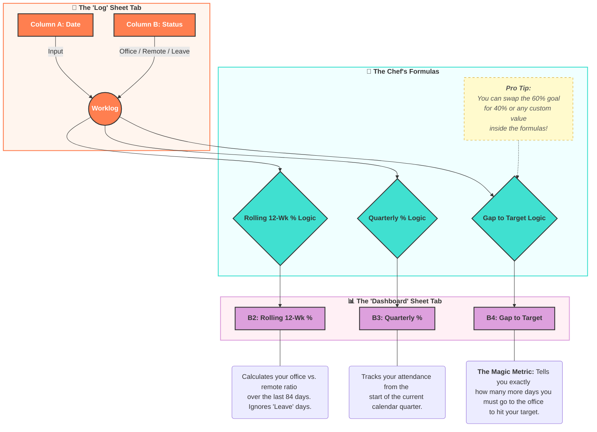

# Google Sheets Tab Explanations

Here is a simple image that explains all the tabs in Google Sheets. Please view it in Light Mode if it isn't legible.

```mermaid
graph TD
    %% Global Styling
    classDef input fill:#FF7F50,stroke:#333,stroke-width:2px,color:#fff,font-weight:bold;
    classDef logic fill:#40E0D0,stroke:#333,stroke-width:2px,font-weight:bold;
    classDef dash fill:#DDA0DD,stroke:#333,stroke-width:2px,font-weight:bold;
    classDef note fill:#FFFACD,stroke:#DAA520,stroke-dasharray: 5 5,color:#555,font-style:italic;

    subgraph Tab1 [<b>📅 The 'Log' Sheet Tab</b>]
        A1[Column A: Date]:::input -->|Input| Worklog((Worklog)):::input
        B1[Column B: Status]:::input -->|Office / Remote / Leave| Worklog
    end

    subgraph Logic [<b>🍳 The Chef's Formulas</b>]
        Worklog --> B2F{Rolling 12-Wk % Logic}:::logic
        Worklog --> B3F{Quarterly % Logic}:::logic
        Worklog --> B4F{Gap to Target Logic}:::logic
        
        Config[<b>Pro Tip:</b><br/>You can swap the 60% goal<br/>for 40% or any custom value<br/>inside the formulas!]:::note
        Config -.-> B4F
    end

    subgraph Tab2 [<b>📊 The 'Dashboard' Sheet Tab</b>]
        B2F --> Metric1[B2: Rolling 12-Wk %]:::dash
        B3F --> Metric2[B3: Quarterly %]:::dash
        B4F --> Metric3[B4: Gap to Target]:::dash
    end

    %% Metric Explanations
    Metric1 --- M1Desc(Calculates your office vs. remote ratio <br/>over the last 84 days. Ignores 'Leave' days.)
    Metric2 --- M2Desc(Tracks your attendance from the <br/>start of the current calendar quarter.)
    Metric3 --- M3Desc(<b>The Magic Metric:</b> Tells you exactly <br/>how many more days you must go to the office <br/>to hit your target.)

    %% Applying styles to subgraphs
    style Tab1 fill:#FFF5EE,stroke:#FF7F50,stroke-width:2px
    style Logic fill:#F0FFFF,stroke:#40E0D0,stroke-width:2px
    style Tab2 fill:#FFF0F5,stroke:#DDA0DD,stroke-width:2px
```
